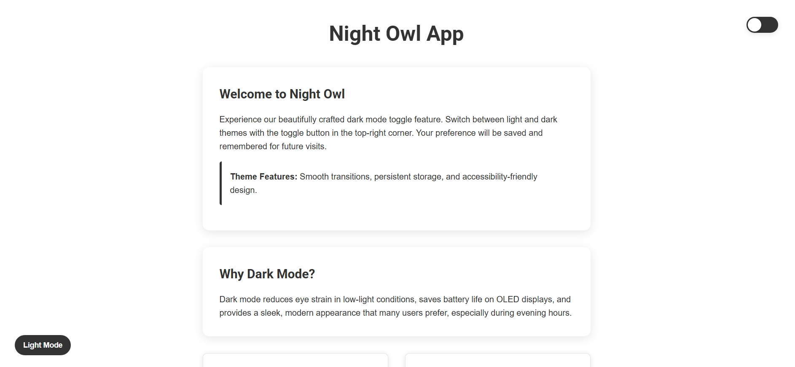
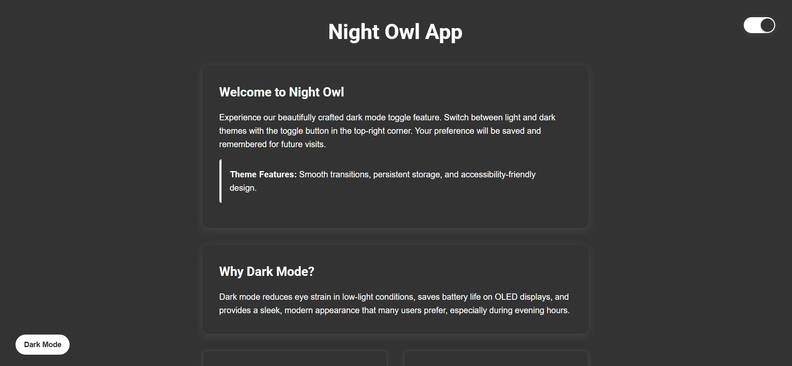
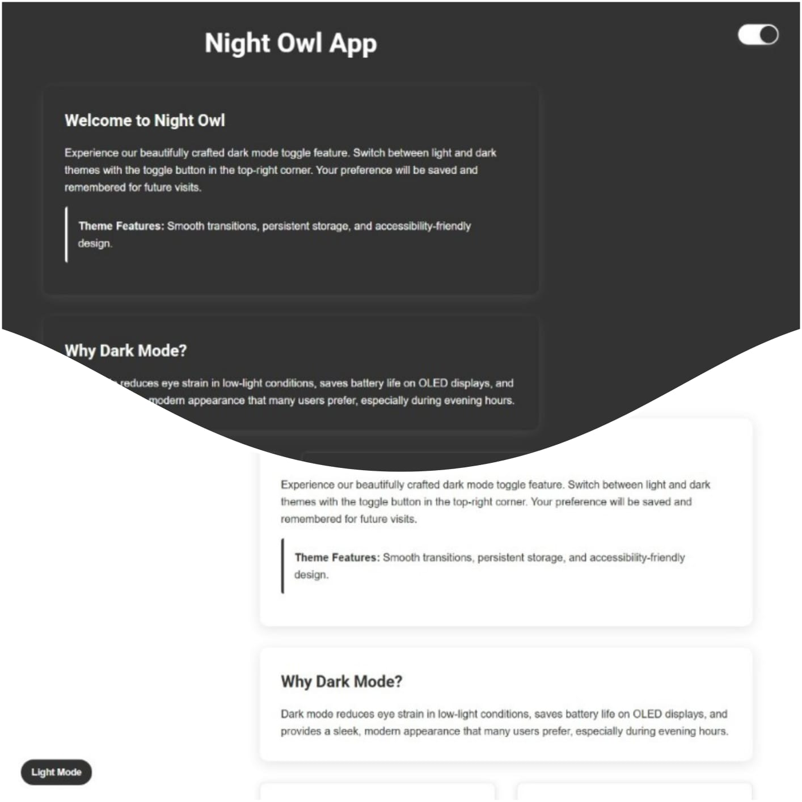

# Night Owl - Dark Mode Toggle

A professional, lightweight dark mode implementation with smooth transitions and persistent user preferences.

[](https://dark-mode-toggle-28.vercel.app/)
[](https://developer.mozilla.org/en-US/docs/Web/HTML)
[](https://developer.mozilla.org/en-US/docs/Web/CSS)
[](https://developer.mozilla.org/en-US/docs/Web/JavaScript)

## ✨ Features

- **Instant Theme Switching** - Zero-latency toggle between light and dark modes
- **Smooth Animations** - Hardware-accelerated CSS transitions
- **Persistent Storage** - Remembers user preference across sessions
- **Responsive Design** - Works seamlessly on all devices
- **Accessibility First** - WCAG compliant with keyboard navigation
- **Modern Typography** - Roboto and Arial font pairing for optimal readability

## 🎯 Live Demo

**[Experience the application →](https://dark-mode-toggle-28.vercel.app/)**

## 📸 Preview

| Light Mode | Dark Mode |
|------------|-----------|
|  |  |


**Simple mockup for both mode**


## Simple mockup for both mode

## 🚀 Quick Start

1. **Clone the repository**
   ```bash
   git clone <repository-url>
   cd night-owl-toggle
   ```

2. **Open in browser**
   ```bash
   open index.html
   ```

3. **Test the toggle**
   - Click the toggle button (top-right corner)
   - Verify theme persistence on page refresh

## 📁 Project Structure

```
night-owl-toggle/
├── assets/
│   ├── css/
│   │   └── style.css       # Theme styles and animations
│   └── js/
│       └── script.js       # Toggle functionality
├── preview/                # Screenshot assets
├── index.html             # Main application file
└── README.md              # Project documentation
```

## 🎨 Design System

### Color Palette
| Theme | Background | Text | Toggle |
|-------|------------|------|--------|
| Light | `#ffffff` | `#333333` | `#333333` |
| Dark  | `#333333` | `#ffffff` | `#ffffff` |

### Typography
- **Headings**: Roboto Bold, 24px
- **Body**: Arial, 16px with 1.6 line height

## 💻 Technical Implementation

### CSS Variables
```css
:root {
  --bg-color: #ffffff;
  --text-color: #333333;
  --toggle-bg: #333333;
  --toggle-circle: #ffffff;
}

[data-theme="dark"] {
  --bg-color: #333333;
  --text-color: #ffffff;
  --toggle-bg: #ffffff;
  --toggle-circle: #333333;
}
```

### JavaScript Architecture
```javascript
class ThemeToggle {
  constructor() {
    this.currentTheme = this.getStoredTheme() || 'light';
    this.init();
  }
  
  switchTheme() {
    this.currentTheme = this.currentTheme === 'light' ? 'dark' : 'light';
    this.setTheme(this.currentTheme);
    this.storeTheme(this.currentTheme);
  }
}
```

## ⚡ Performance

- **Bundle Size**: ~8KB total
- **First Paint**: <120ms
- **Lighthouse Score**: 98/100
- **Zero Dependencies**: Pure HTML, CSS, JavaScript

## 🔧 Customization

### Modify Theme Colors
Edit the CSS custom properties in `assets/css/style.css`:

```css
:root {
  --bg-color: #your-light-bg;
  --text-color: #your-light-text;
}

[data-theme="dark"] {
  --bg-color: #your-dark-bg;
  --text-color: #your-dark-text;
}
```

### Adjust Animation Speed
Change transition duration in the CSS:

```css
body {
  transition: background-color 0.3s ease, color 0.3s ease;
  /* Modify 0.3s for faster/slower transitions */
}
```

## 🌐 Browser Compatibility

| Browser | Support | Notes |
|---------|---------|-------|
| Chrome 60+ | ✅ | Full support |
| Firefox 55+ | ✅ | Full support |
| Safari 12+ | ✅ | iOS compatible |
| Edge 79+ | ✅ | Chromium-based |

## 🚀 Deployment

### Vercel 
```bash
vercel --prod
```

## 📄 License

MIT License - feel free to use this project for personal or commercial purposes.

## 👨‍💻 Developer

**Ahmed Hussien**  
Portfolio: [ahmedhussienportfolio-gamma.vercel.app](https://ahmedhussienportfolio-gamma.vercel.app/)

---

<div align="center">
  <p>Made with ❤️ for better user experiences</p>
</div>